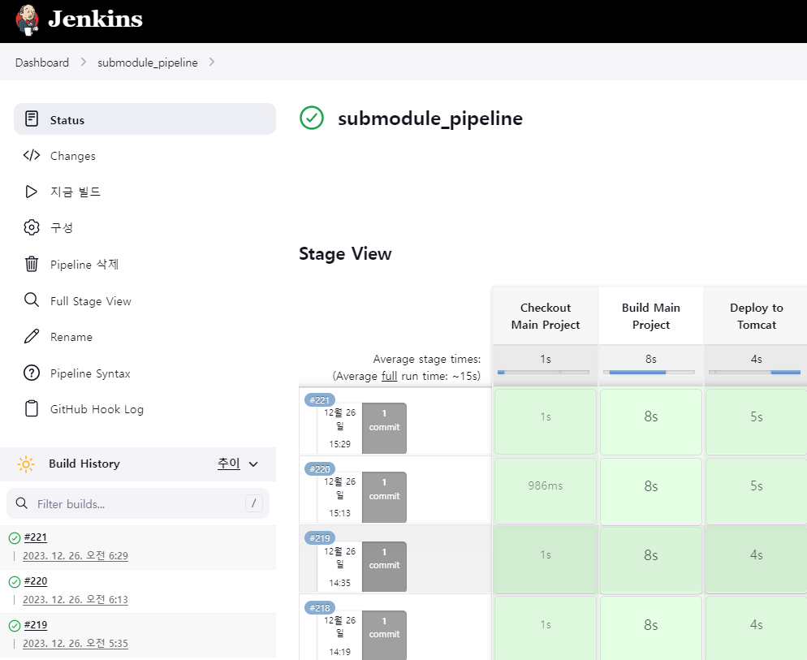

# 나혼자 먹는다

## Description
 - 클라우드 기반 웹 데브옵스 프로젝트 개발자 과정 3기 4조 세미프로젝트
 - 2023.12.01. ~ 2023.12.26.
 - spring framework 를 사용한 음식 레시피 공유 플랫폼 개발

## Usage 
- http://175.106.97.69:8080/semi
- 회원 가입 / 로그인 후 상단 메뉴의 기능 사용

# my work
- jenkins CI/CD 관리
- ncloud 서버 설정 및 관리

- git 관리
    - 민감 정보 private repo 분리
    - git flow 적용
- 인증(로그인) session 관리 자동화(annotation + exception) 

## Image


## Software Used
- Spring framework
    - maven
    - mybatis
- mysql
- ncloud
- docker
    - tomcat container
    - jenkins container

## Jenkins pipeline

```
pipeline {
    agent any

    environment {
        MAIN_REPO = 'https://github.com/insikkim1234/Semiproject.git'
        SUBMODULE_REPO = 'https://github.com/cyanO94/bitcampSensitiveInfo.git'
        GIT_CREDENTIALS = 'cyanO94'
    }

    stages {
        stage('Checkout Project') {
            steps {
                script {
                    checkout([$class: 'GitSCM', 
					branches: [[name: '*/main']], 
					doGenerateSubmoduleConfigurations: false, 
					extensions: [[$class: 'SubmoduleOption', disableSubmodules: false, parentCredentials: true, recursiveSubmodules: true, reference: '', trackingSubmodules: false]], 
					submoduleCfg: [], 
					userRemoteConfigs: [[credentialsId: env.GIT_CREDENTIALS, url: env.MAIN_REPO]]])
                }
            }
        }

        stage('Build Project') {
            steps {
                script {
                    sh 'mvn clean install'
                }
            }
        }

        stage('Deploy to Tomcat') {
            steps {
                script {
                    sh "curl --upload-file target/semi-1.0.0-BUILD-SNAPSHOT.war '[IP]:[PORT]/manager/text/deploy?path=/semi&update=true' -u [ID]:[PASSWORD]"
                }
            }
        }
    }
}
```

## Contributor
[한충희](https://github.com/mongdamhwa)
[이승민](https://github.com/2Smean)
[이재영](https://github.com/jaeyoung99-lee)
[유서연](https://github.com/yseoyeon0915)
[김인식](https://github.com/insikkim1234)
[차후련](https://github.com/chahooreun)
[오원찬](https://github.com/cyanO94)
